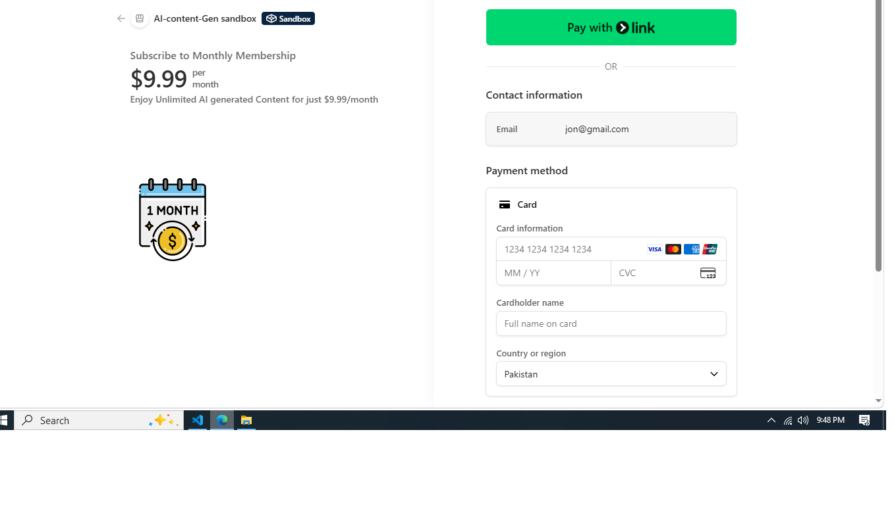
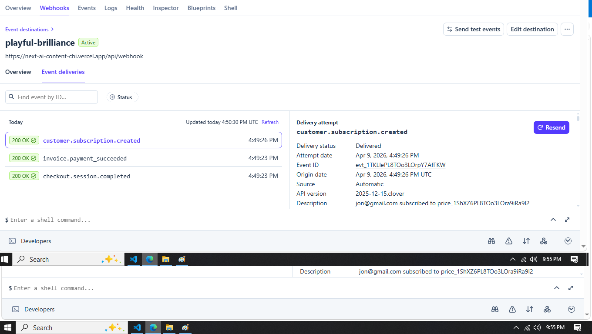

# 🚀 AI Content Generator SaaS

A modern AI-powered SaaS application that helps users generate high-quality content for blogs, websites, and social media in seconds.

---

## 🌐 Live Demo

👉 https://next-ai-content-chi.vercel.app

---

## ✨ Features

- 🧠 AI-powered content generation  
- ✍️ Blog & article writing  
- 📱 Social media post creation  
- 🔍 SEO-optimized content  
- ⚡ Fast and simple UI  
- 🔐 User authentication system  

---

## 🛠️ Tech Stack

- **Frontend:** Next.js  
- **Backend:** API Routes / Server Actions  
- **Styling:** Tailwind CSS / shadcn 
- **Authentication:** NextAuth (Credentials, Google)  
- **Deployment:** Vercel  
- **AI Integration:** OpenAI API  

---

## 📸 Screenshots

### Stripe Integration - Step 1


### Stripe Integration - Step 2


---

## 🚀 Getting Started

### 1. Clone the repository

```bash
git clone https://github.com/qaiserjavaid00-cyber/nextAI-content.git
cd nextAI-content
```

### 2. Install dependencies

```bash
npm install
```

### 3. Setup environment variables

Create a `.env` file and add:

```env
OPENAI_API_KEY=your_api_key_here
NEXT_PUBLIC_APP_URL=http://localhost:3000
```

---

### 4. Run the development server

```bash
npm run dev
```

Now open:  
👉 http://localhost:3000

---

## 💡 Usage

1. Sign up / Log in  
2. Choose a content template  
3. Enter your topic or prompt  
4. Generate AI content instantly  

---

## 📈 Future Improvements

- 💳 Subscription & pricing plans  
- 📊 User dashboard with usage tracking  
- 🧾 Content history & saved drafts  
- 🌍 Multi-language support  
- 📣 Advanced SEO tools  

---

## 🤝 Contributing

Contributions are welcome!

1. Fork the repo  
2. Create a new branch  
3. Make your changes  
4. Submit a pull request  

---

## 📄 License

This project is licensed under the MIT License.

---

## 👨‍💻 Author

Built by **Qaiser Javed**

---

## ⭐ Support

If you like this project, consider giving it a ⭐ on GitHub!
